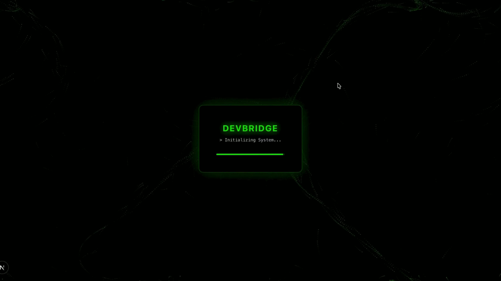

# DevBridge - AI-Powered Requirements Architect

[](assets/DemoVideo.mp4?raw=true)
Click the above image to watch demo video

DevBridge is an AI-powered requirements gathering and architectural design tool. It uses a local LLM (Ollama) to generate user stories, API endpoints, and edge cases based on user input, storing conversation history in proper contexts.

## Tech Stack

- **Frontend**: Next.js 14, TailwindCSS, React Markdown, Lucide Icons
- **Backend**: FastAPI (Python), JWT Authentication
- **Database**: MongoDB (Local) for chat history & sessions
- **Vector DB**: Qdrant (Local) for memory/RAG
- **AI Engine**: Ollama (Running locally with `qwen3` and `nomic-embed-text`)

---

## Prerequisites

Ensure you have the following installed:

1.  **Node.js** (v18+)
2.  **Python** (v3.9+)
3.  **Ollama** ([Download here](https://ollama.com))
4.  **MongoDB** (Community Edition or Docker)
5.  **Qdrant** (Docker recommended)

---

## Setup Instructions

### 1. Setup Local AI Models (Ollama)

Install Ollama and pull the required models specified in `app/config.py`.

```bash
# Start Ollama service
ollama serve

# In a new terminal, pull the models
ollama pull qwen3
ollama pull nomic-embed-text
```

### 2. Setup Databases

You can run MongoDB and Qdrant using Docker or local installations.

#### Option A: Docker (Recommended)

```bash
# Run MongoDB
docker run -d -p 27017:27017 --name local-mongo mongo:latest

# Run Qdrant
docker run -d -p 6333:6333 --name local-qdrant qdrant/qdrant
```

#### Option B: Local Installation

- **MongoDB**: Start `mongod` service on port `27017`.
- **Qdrant**: Download binary and run on port `6333`.

### 3. Backend Setup

Navigate to the project root (where `main.py` is located).

```bash
# Create virtual environment
python3 -m venv .venv
source .venv/bin/activate  # Mac/Linux
# .venv\Scripts\activate   # Windows

# Install dependencies
pip install -r requirements.txt

# Start the Backend Server
uvicorn app.main:app --reload --port 8000
```

The backend API will be available at `http://localhost:8000`.
Docs available at `http://localhost:8000/docs`.

### 4. Frontend Setup

Navigate to the frontend directory (`DevBridge`).

```bash
cd DevBridge

# Install dependencies
npm install

# Run the development server
npm run dev
```

The frontend will be available at `http://localhost:3000`.

---

## Configuration

Environment variables can be set in a `.env` file or exported in your shell. Defaults are configured in `app/config.py`.

| Variable | Default | Description |
| :--- | :--- | :--- |
| `MONGO_URI` | `mongodb://localhost:27017` | MongoDB connection string |
| `QDRANT_HOST` | `localhost` | Qdrant host |
| `QDRANT_PORT` | `6333` | Qdrant port |
| `OLLAMA_BASE_URL` | `http://localhost:11434/v1` | Ollama API URL |
| `SECRET_KEY` | `hackathon_...` | JWT Secret Key |

---

## Features

- **Real-time Chat**: Conversational interface with memory.
- **Structured Output**: AI responses are styled as system logs with markdown support.
- **History Tracking**: All conversations are saved and can be resumed.
- **RAG Memory**: Uses Qdrant to recall context from previous interactions.
